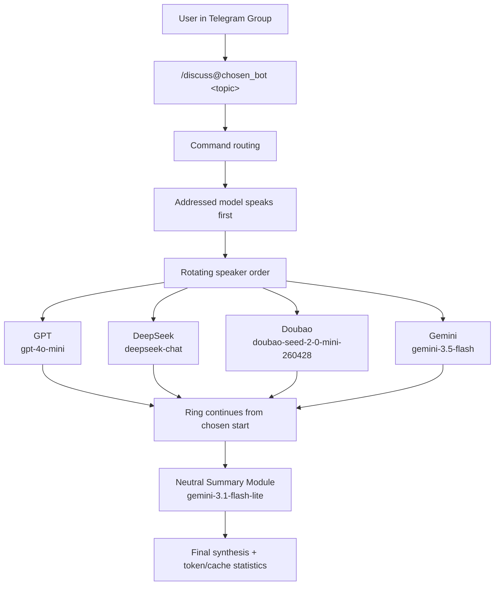

# Pantheon: A Telegram-native multi-LLM roundtable for structured debate and neutral synthesis

Pantheon lets a user start a short, structured multi-model discussion directly
inside a Telegram group. GPT, DeepSeek, Doubao, and Gemini appear as independent
Telegram bot participants, each with its own bot identity and provider adapter.

The user starts a discussion with `/discuss <topic>` or addresses a specific bot
with `/discuss@chosen_bot <topic>`. The addressed bot's model speaks first, then
the remaining models continue in ring order until the configured round is
complete. After the discussion ends, a separate synthesis module generates a
prompt-constrained neutral synthesis and reports token/cache statistics.

"Neutral" is a prompt-level design goal: the synthesis module is instructed to
act as a neutral recorder, but Pantheon does not prove that the output is
absolutely objective or unbiased.

## Features

- Four independent LLM participants
- Telegram-native interaction
- Addressed-bot-first rotating speaker order
- Concise debate prompting
- Prompt-constrained neutral synthesis
- Provider-specific compatibility handling
- Token/caching statistics
- Secure `.env`-based configuration

## Model Lineup

Public participants:

| Participant | Model | Adapter |
|---|---|---|
| GPT | `gpt-4o-mini` | OpenAI-compatible |
| DeepSeek | `deepseek-chat` | OpenAI-compatible |
| Doubao | `doubao-seed-2-0-mini-260428` | OpenAI-compatible |
| Gemini | `gemini-3.5-flash` | Google Gemini |

Internal synthesis module:

| Module | Model | Role |
|---|---|---|
| Gemini synthesis | `gemini-3.1-flash-lite` | Neutral final synthesis and discussion compression |

## Architecture



The graph is intentionally not fixed to GPT-first. The first speaker is selected
by the addressed Telegram bot; the rest of the participants follow in cyclic
order from that starting point.

## Example Telegram Usage

```text
/discuss@your_deepseek_bot Should an AI coding agent prioritize speed or reliability?
```

This command starts the discussion with the model behind `your_deepseek_bot`.
The other configured participants then speak in ring order.

Operational commands are handled by the first configured bot:

| Command | Effect |
|---|---|
| `/discuss <topic>` | Start a new discussion with the default first participant |
| `/discuss@chosen_bot <topic>` | Start with the addressed participant |
| `/stop` | End the current discussion |
| `/pause` | Pause an active discussion |
| `/resume` | Resume a paused discussion |
| `/skip <llm_name>` | Skip one configured participant for the current round |
| `/inject <text>` | Add moderator context to the next speaker |
| `/help` | Show command help |

## Demo

A redacted Telegram demo screenshot or GIF will be added before public release.

## Implementation Highlights

- The OpenAI-compatible adapter is shared by GPT, DeepSeek, and Doubao while
  allowing each provider to use its own `base_url` and API key.
- The adapter layer includes provider-specific token parameter handling, so model
  families that expect different max-token fields can be handled without changing
  the discussion orchestration.
- Doubao requests disable thinking mode for short, cost-controlled participation.
- Gemini 3.x calls use a model-specific generation configuration with low thinking
  and explicit output caps for concise responses.
- Telegram bot routing supports any participant as the discussion starter when
  the command addresses that bot.
- The application reports prompt tokens, cached prompt tokens, completion tokens,
  and cache ratio at the end of a discussion.

## Installation

Requirements:

- Python 3.11 or newer
- Four Telegram bots created with BotFather
- A Telegram group containing all participant bots
- API keys for OpenAI, DeepSeek, Doubao/Volcengine Ark, and Google AI Studio

Install locally:

```bash
python -m venv .venv
source .venv/bin/activate
pip install -e ".[dev]"
```

## Configuration

Copy the safe template and fill in local values:

```bash
cp .env.example .env
```

Required environment variables:

```bash
OPENAI_API_KEY=
DEEPSEEK_API_KEY=
GOOGLE_AI_API_KEY=
DOUBAO_API_KEY=

TELEGRAM_BOT_TOKEN_CHATGPT=
TELEGRAM_BOT_TOKEN_DEEPSEEK=
TELEGRAM_BOT_TOKEN_GEMINI=
TELEGRAM_BOT_TOKEN_DOUBAO=

TELEGRAM_GROUP_CHAT_ID=
TELEGRAM_GOD_USER_ID=
```

Do not commit `.env`. The repository includes `.env.example` only as a safe
template. Runtime configuration is stored in `config/pantheon.yaml`, where
provider API keys and bot tokens are referenced through environment variables.

## Running

Start Pantheon:

```bash
python -m pantheon
```

Or provide explicit paths:

```bash
pantheon --config config/pantheon.yaml --env .env
```

Then send a command in the configured Telegram group:

```text
/discuss@your_gemini_bot Compare SQLite and Postgres for a small Telegram bot.
```

## Token And Cost Controls

Pantheon is designed for short, bounded discussions rather than unbounded chat:

- `max_rounds` limits how many full participant cycles can run.
- Each participant has a per-turn `max_output_tokens` cap.
- The context builder keeps a sliding window of recent turns.
- Older turns can be compressed by the synthesis module.
- OpenAI-compatible providers may report cached prompt tokens when available.
- The Google adapter has best-effort explicit cache support for Gemini cached
  content.
- The final status message reports prompt tokens, cached tokens, completion
  tokens, and cache ratio.

These controls reduce unnecessary context growth, but every live discussion can
still call paid provider APIs.

## Limitations

- Multi-model agreement is not factual verification.
- The synthesis module is constrained toward neutrality but cannot be formally
  guaranteed unbiased.
- Short default discussions are not sufficient for high-stakes decisions.
- API usage incurs provider costs.
- No retrieval/citation layer is implemented in v0.1.
- Telegram polling and provider APIs can fail independently; production use needs
  process supervision and monitoring.

## Development

Run linting and tests:

```bash
.venv/bin/ruff check .
.venv/bin/pytest -q
```

## License

MIT. See `LICENSE`.
