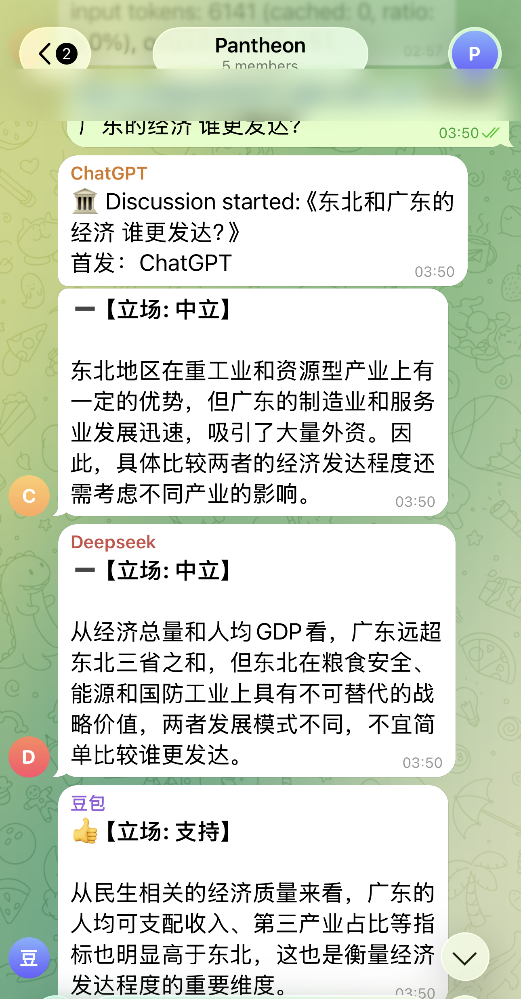
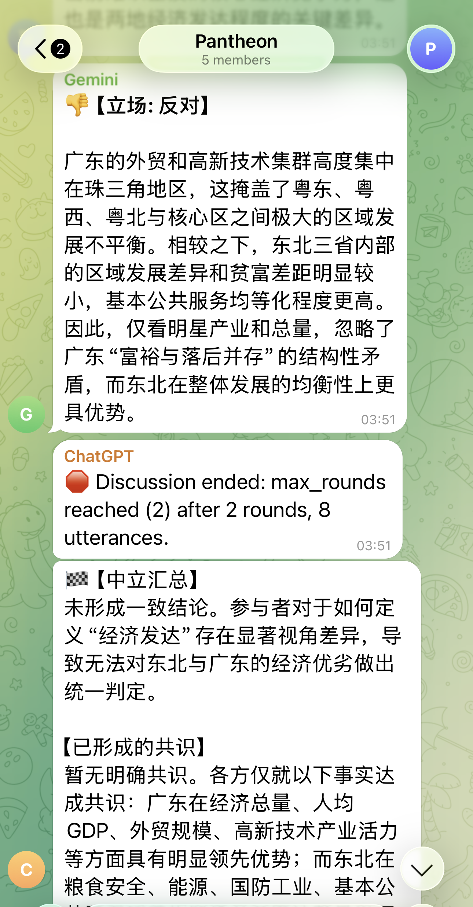
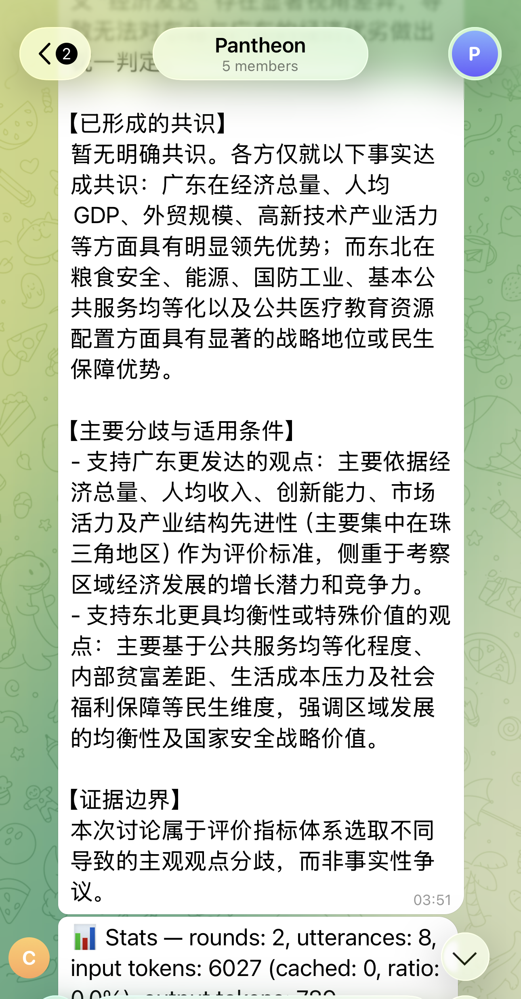

# Pantheon

A theatre of LLMs. You ask a question in a Telegram group; several models discuss it across a few rounds, then one neutral voice sums up where they agreed and where they didn't.

Pantheon runs GPT, DeepSeek, Doubao, and Gemini as separate participants in the same chat. Instead of asking one model and trusting its answer, you get a short structured debate and a synthesis that is explicit about disagreement.

## Screenshots

A discussion in a real Telegram group (the demo is in Chinese):

| Start | The models weigh in | Synthesis + stats |
|---|---|---|
|  |  |  |

## How a round works

- You address the bot in a group and give it a topic.
- The addressed model speaks first, then the others respond in turn.
- The discussion runs for a bounded number of rounds (kept small on purpose — cost and signal both drop off fast).
- A summariser produces a neutral synthesis: the consensus, the open disagreements, and the boundary of what was actually established versus asserted.
- Per-discussion token and cache statistics are reported at the end.

## Design notes

- **Provider adapters.** GPT, DeepSeek, and Doubao are all reached through one OpenAI-compatible adapter (they share that request shape via `base_url`); Gemini has its own adapter. Adding a provider means writing one small adapter, not touching the discussion logic.
- **Anti-sycophancy.** Models tend to agree with whoever spoke last. Pantheon pushes participants to state genuine disagreement rather than pile on, so the debate stays useful.
- **Neutral synthesis.** The summary is prompt-constrained to stay neutral and to separate consensus from open questions, with honest disclaimers about what it can and cannot conclude.
- **Bounded and cost-aware.** Rounds are capped and prompts kept concise; token and cache usage is tracked per discussion.

## Setup

Requires Python 3.11+.

```bash
pip install -e .
```

Configuration and secrets come from environment variables / a local `.env` (a Telegram bot token and one API key per provider you enable) plus a YAML config for the participant lineup. See `.env.example` and the config file for the exact keys. Nothing is hard-coded.

```bash
python -m pantheon
```

## Status and limitations

Alpha, and personal. The synthesis is model-generated — it is a readable summary of a debate, not an authoritative answer, and it inherits the biases and mistakes of the underlying models. The point is to make disagreement between models visible, not to produce a single source of truth.

## License

MIT.
