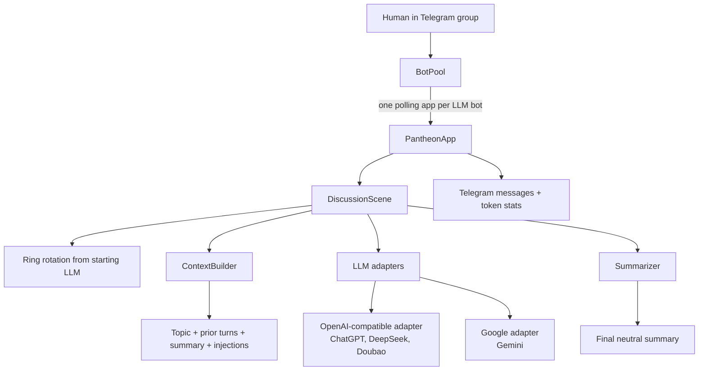

# Pantheon

Pantheon is a Telegram group-chat bot for multi-LLM roundtable discussions.
One human starts a topic in Telegram, and several LLM-backed Telegram bots speak
in sequence. The current default setup uses four public participant bots:

| Participant | Provider adapter | Model |
|---|---|---|
| ChatGPT | OpenAI-compatible | `gpt-4o-mini` |
| DeepSeek | OpenAI-compatible | `deepseek-chat` |
| Doubao | OpenAI-compatible | `doubao-seed-2-0-mini-260428` |
| Gemini | Google Gemini | `gemini-3.5-flash` |

After a discussion ends, a background summarizer produces a final summary. In the
current config, the summarizer uses the Google adapter with `gemini-3.1-flash-lite`.

Pantheon is meant for observing how different LLMs frame, challenge, and converge
around a topic. It is not a fact-checking system and should not be treated as an
automated decision maker.

## Current Status

Implemented in the current codebase:

- Four Telegram bots can listen for `/discuss`; each LLM has its own bot token.
- An addressed command such as `/discuss@your_gemini_bot <topic>` starts with the
  addressed model.
- An unaddressed `/discuss <topic>` defaults to the first configured model.
- The discussion proceeds in ring order from the starting model until every
  configured participant has had a turn in the round.
- Termination supports a hard `max_rounds`, `/stop`, and optional all-participant
  `check` consensus.
- The app sends an automatic final summary and token statistics after the run.
- A prompt-level neutral-recorder rule exists for the final summary.

Not implemented yet:

- Hot reload via `/reload`.
- Persistent session storage.
- Multiple scenes such as games or collaborative editing.
- A formal verifier that proves the final summary is neutral.

## Architecture



The YAML file at `config/pantheon.yaml` is the source of truth for participants,
model names, provider endpoints, rotation order, summary settings, and termination
limits. Secrets are referenced with `${ENV_VAR}` placeholders and loaded from
environment variables or a local `.env` file.

## Telegram Interaction

Start a discussion:

```text
/discuss Should we release this project as open source?
```

Start with a specific bot:

```text
/discuss@your_deepseek_bot What are the risks of this plan?
```

Operational commands are handled by the first configured bot:

| Command | Effect |
|---|---|
| `/discuss <topic>` | Start a new discussion |
| `/stop` | End the current discussion |
| `/pause` | Pause an active discussion |
| `/resume` | Resume a paused discussion |
| `/skip <llm_name>` | Skip one configured participant for the current round |
| `/inject <text>` | Add moderator context to the next speaker |
| `/help` | Show command help |

Each participant is instructed to prefix replies with one of:

```text
【立场: 支持】
【立场: 反对】
【立场: 中立】
【立场: 质疑】
【立场: check】
```

When every required participant replies with `check` in the same round, the
discussion can terminate as consensus. The default config also has `max_rounds: 2`,
so short runs are intentionally bounded.

## Installation

Requirements:

- Python 3.11 or newer
- Four Telegram bots created with BotFather
- A Telegram group that contains all four bots
- API keys for OpenAI, DeepSeek, Google AI Studio, and Doubao/Volcengine Ark

Install locally:

```bash
python -m venv .venv
source .venv/bin/activate
pip install -e ".[dev]"
```

## Configuration

Create a local environment file:

```bash
cp .env.example .env
```

Fill in the local `.env` file with your own values:

```bash
OPENAI_API_KEY=
DEEPSEEK_API_KEY=
GOOGLE_AI_API_KEY=
DOUBAO_API_KEY=

TELEGRAM_BOT_TOKEN_CHATGPT=
TELEGRAM_BOT_TOKEN_DEEPSEEK=
TELEGRAM_BOT_TOKEN_GEMINI=
TELEGRAM_BOT_TOKEN_DOUBAO=

TELEGRAM_GROUP_CHAT_ID=
TELEGRAM_GOD_USER_ID=
```

Do not commit `.env`. The repository includes `.env.example` only as a safe template.

The default public participants are configured in `config/pantheon.yaml`:

```yaml
llms:
  - name: chatgpt
    display_name: "ChatGPT"
    adapter: openai
    model: gpt-4o-mini

  - name: deepseek
    display_name: "DeepSeek"
    adapter: openai
    model: deepseek-chat

  - name: doubao
    display_name: "Doubao"
    adapter: openai
    model: doubao-seed-2-0-mini-260428

  - name: gemini
    display_name: "Gemini"
    adapter: google
    model: gemini-3.5-flash
```

The background summarizer is configured separately:

```yaml
summarizer:
  adapter: google
  model: gemini-3.1-flash-lite
  api_key: ${GOOGLE_AI_API_KEY}
  max_output_tokens: 600
```

## Running

Start Pantheon:

```bash
python -m pantheon
```

Or use an explicit config and env path:

```bash
pantheon --config config/pantheon.yaml --env .env
```

Then send a command in the configured Telegram group:

```text
/discuss Compare SQLite and Postgres for a small Telegram bot.
```

## Token And Cost Controls

Pantheon includes several cost-control mechanisms:

- `max_rounds` limits how many full participant cycles can run.
- Each participant has a per-turn `max_output_tokens` limit.
- The context builder keeps a sliding window of recent turns.
- Older turns can be compressed by the background summarizer.
- OpenAI-compatible providers may report cached prompt tokens when available.
- The Google adapter has best-effort explicit cache support for Gemini cached content.
- The final Telegram status message reports prompt tokens, cached tokens, completion
  tokens, and cache ratio for the discussion.

These controls reduce unnecessary context growth, but they do not eliminate API
costs. Every live discussion can still call paid provider APIs.

## Safety Notes

- Keep `.env` local. It contains API keys, Telegram bot tokens, and the group chat ID.
- Do not paste real tokens into README files, screenshots, logs, issues, or support
  messages.
- `logs/`, caches, virtual environments, backup files, archives, and scratch text
  files are excluded by `.gitignore`.
- If a secret was ever committed to a Git history, rotate it. Removing it from the
  working tree is not enough.

## Known Limitations

- Multi-model discussion is not fact checking. Models can share the same wrong
  assumption or repeat unsupported claims.
- The final summary cannot be theoretically guaranteed to be absolutely objective.
- The current neutral summary rule is implemented as a prompt-level "neutral
  recorder" instruction, not as a formal verifier or second-pass audit.
- The default short run length is not suitable for complex, high-risk decisions.
- API calls can produce provider costs.
- Telegram polling and provider APIs can fail independently; production deployments
  need process supervision and monitoring.
- `check` consensus is a conversational signal, not a proof that the answer is true.

## Development

Run linting and tests:

```bash
ruff check .
pytest -q
```

## License

MIT. See `LICENSE`.
